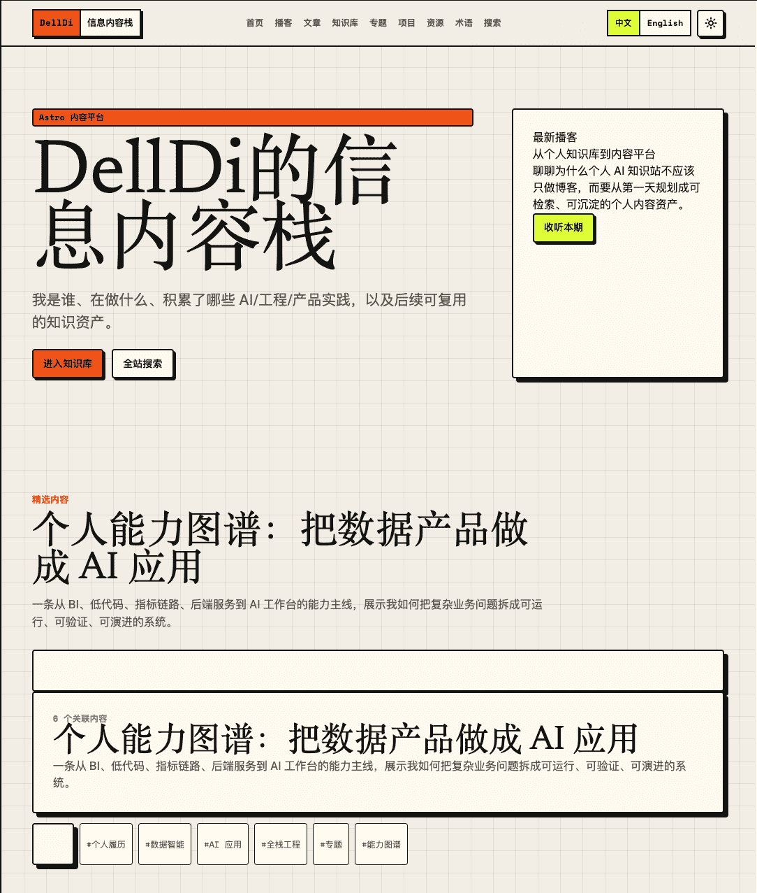

# AI 知识实践站

这是一个以站点所有者本人为中心的 Astro 个人内容站，服务个人品牌展示、知识沉淀、技能储备、项目复盘和长期成长记录。第一阶段覆盖播客、文章、知识库、专题、项目案例、资源库、术语库、搜索、RSS、站点地图、黑夜模式、Docker 部署，以及后续后台管理、CMS、评论和 AI 检索扩展。

## 项目截图



## 技术栈

- Astro （静态站点生成器）
- React （前端框架）
- TypeScript （类型检查）
- Tailwind CSS （样式框架）
- Payload CMS （内容管理系统）
- PostgreSQL （数据库）
- MinIO （对象存储）
- Docker （容器化）

## 当前状态

项目已经从第一版静态站骨架推进到“前台内容体验 + CMS 后台试点 + 发布工作流基础闭环”阶段：

- `apps/web` 是 Astro 前台读侧，已覆盖首页、播客、文章、知识库、专题、项目、资源、术语、时间线、标签、搜索、RSS、播客 RSS、Sitemap、404 和 `/zh-CN/admin`
- 中文表达优先，主路由固定为 `/zh-CN`；英文 `/en` 作为后续国际化预留
- 内容集合覆盖 8 类内容，公开页面只读取 `status: published`
- 已补充中文 seed 内容、播客时间轴与资源、知识库树、上下篇导航、相关内容推荐、JSON-LD 和默认 OG 图
- 已建立 `packages/content-contract`，让 Astro 与 CMS 共享语言、状态、知识区、资源类型和 Block 契约
- `apps/cms` 已作为 Payload CMS 3.x 后台基座接入，包含 users / posts / podcast / knowledge / topics / projects / resources / glossary / timeline / media
- `infra/docker-compose.local.yml` 提供 PostgreSQL + MinIO + CMS 的本地开发栈
- `infra/docker-compose.prod.yml` 提供 PostgreSQL + Payload CMS + Astro Node 前台的生产运行栈，媒体存储走阿里云 OSS，不启动 MinIO
- 8 个内容集合已支持本地 MDX + CMS API 混合加载：未设置 `CMS_API_URL` 时只读本地内容，设置后先读本地内容再叠加 CMS published 内容
- Payload 发布 hooks、Astro SSR 草稿预览和 `/healthz` 已落地
- `/zh-CN/admin` 当前是 noindex 的发布运营看板，不承载真实写入；真实写入进入 Payload CMS 后台
- Pagefind 搜索目前是基础搜索，语言过滤已在前端结果层处理；集合/标签筛选仍在后续迭代

## 常用命令

```bash
pnpm install
pnpm -C apps/web dev
pnpm -C apps/web check
pnpm -C apps/web build
pnpm -C apps/web preview
pnpm --filter @personal-ai-knowledge-site/cms typecheck
pnpm --filter @personal-ai-knowledge-site/content-contract typecheck
pnpm infra:local
pnpm infra:prod:up
pnpm infra:prod:build-web
pnpm infra:prod:web
```

## Docker 预览

```bash
docker compose up --build
```

启动后访问：

- `http://localhost:8080/zh-CN/`
- `http://localhost:8080/en/`
- `http://localhost:8080/rss.xml`
- `http://localhost:8080/podcast/rss.xml`

## 后端开发栈

```bash
pnpm infra:local
```

启动后访问：

- `http://localhost:3000/admin`：Payload CMS 后台
- `http://localhost:9001`：MinIO 控制台
- `http://localhost:4321/zh-CN/admin`：前台发布运营看板

本地 CMS 初始化账号：`875372314@qq.com` / `123456`。

前台连接 CMS 试点：

```bash
CMS_API_URL=http://localhost:3000/api CMS_ADMIN_URL=http://localhost:3000/admin pnpm -C apps/web dev
```

## 生产部署栈

```bash
cp infra/env/production.example.env infra/env/production.env
pnpm infra:prod:up
pnpm infra:prod:build-web
pnpm infra:prod:web
```

生产模式不启动 MinIO。CMS 的 `S3_*` 环境变量应指向阿里云 OSS。

## 目录结构

```txt
apps/web                         Astro 前台（读侧）
apps/cms                         Payload CMS 后台（写侧，Next.js + Payload 3.x）
packages/content-contract        内容契约层（共享类型/枚举/Block 契约，单一事实源）
docs/agile                       Markdown 项目管理：路线图、史诗、故事、迭代
docs/architecture                架构文档和平台决策
infra/docker-compose.local.yml   本地开发后端栈（PostgreSQL + MinIO + CMS）
infra/docker-compose.prod.yml    生产运行栈（PostgreSQL + CMS + Astro Node 前台，媒体走 OSS）
infra/env/*.example.env          本地/生产环境变量模板
.skills/astro-content-platform   项目专用 Agent Skill
AGENTS.md                        Agent 开发约束
Dockerfile                       前台 Astro Node 生产镜像
docker-compose.yml               前台本地生产部署预览
nginx/default.conf               备用 Nginx 静态配置
```

## 内容定位

首版内容以个人展示和自我沉淀为主：对外呈现“我是谁、做过什么、在积累什么能力”，对内沉淀可复用的知识资产和技能储备。中文是当前主要表达语言，英文路由保留但不是当前内容主线；新增公开内容时，应优先保证中文标题、摘要、标签和页面描述完整。

## 项目管理入口

- 当前状态：`docs/agile/project-status.md`
- 路线图：`docs/agile/roadmap.md`
- 发布检查：`docs/agile/acceptance/release-checklist.md`
- CMS 架构：`docs/architecture/cms-architecture.md`
- 内容 Loader：`docs/architecture/content-loader.md`
- 发布工作流：`docs/architecture/publish-workflow.md`

## License

MIT
